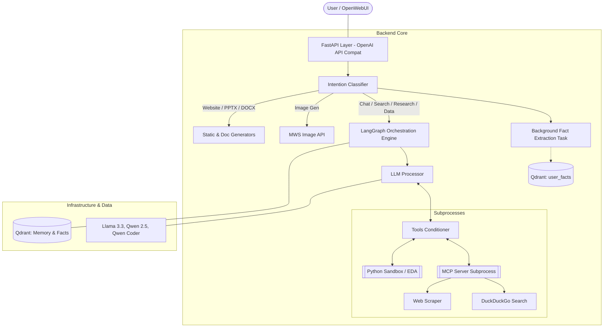

# MTS AI Assistant: Unified Intelligent Workspace

Данный проект представляет собой высокотехнологичный бэкенд для интеллектуального ассистента, спроектированный как единое рабочее пространство (Unified Workspace). Система объединяет возможности обработки текста, голоса, компьютерного зрения, глубокого анализа данных и генерации контента в рамках одного интерфейса.

## Концепция проекта

В основе MTS AI Assistant лежит философия Unified UI и Smart Routing. Вместо традиционного выбора конкретных моделей пользователем, система берет на себя роль интеллектуального диспетчера. 

Ассистент автоматически классифицирует входящие запросы и выстраивает оптимальный путь обработки (Pipeline of Intent), динамически подключая необходимые инструменты, модели машинного обучения и механизмы долгосрочной памяти. Это позволяет пользователю взаимодействовать с системой на естественном языке, не отвлекаясь на технические детали настройки нейросетей.

## Архитектура системы

Архитектура решения построена по многослойному принципу оркестрации, обеспечивающему гибкость и масштабируемость:

1.  **Уровень 1: FastAPI Proxy**. Обеспечивает полную совместимость с OpenAI API Protocol. Это позволяет подключать любой современный фронтенд (например, OpenWebUI) без модификации кода клиента.
2.  **Уровень 2: Smart Router (Fast-Track + LLM)**. Отвечает за детекцию намерений (Intent Detection). Использует комбинацию мгновенных Regex-фильтров (для запросов на аналитику, презентации, сайты) и LLM-классификатора (llama-3.1-8b) для сложных случаев.
3.  **Уровень 3: LangGraph Engine**. Ядро системы, управляющее логикой рассуждений и состоянием (Stateful orchestration). Поддерживает циклические графы для Deep Research и Data Analysis. Специализированная модель `qwen3-coder-480b-a35b` используется для задач кодинга и аналитики.
4.  **Уровень 4: MCP (Model Context Protocol)**. Изолированный слой инструментов, запущенный как отдельный подпроцесс. Обеспечивает безопасное выполнение операций веб-поиска и парсинга контента.

## Диаграмма архитектуры

## Технологический стек

Проект интегрирует передовые решения в области генеративного ИИ и системной разработки:

*   **Модели (MWS API)**: llama-3.3-70b-instruct, qwen2.5-72b-instruct, bge-m3, qwen-image-lightning, whisper-turbo-local.
*   **Фреймворки**: FastAPI (API layer), LangGraph (Multi-agent orchestration), FastMCP (Tool protocol).
*   **Базы данных**: Qdrant (Vector Database для RAG и Memory 2.0).
*   **Интерфейс**: OpenWebUI (OpenAI-compatible frontend).

## Навигация по документации

Для детального ознакомления с отдельными аспектами проекта используйте следующие разделы:

*   **[Features.md](Features.md)** — Подробный перечень реализованных функций, текущий статус разработки и спецификации используемых инструментов.
*   **[Setup Guide](docs/setup.md)** — Инструкции по развертыванию инфраструктуры через Docker Compose, конфигурации переменных окружения и интеграции с фронтендом.
*   **[Документация (docs/)](docs/index.md)** — Расширенная техническая документация для разработчиков, включая описание модулей памяти, архитектуры графов и тематических стилей MkDocs (порт 9000).
