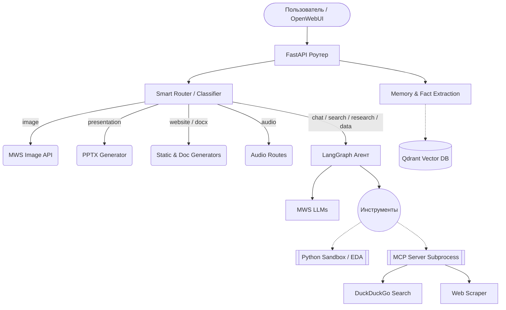

# Архитектура проекта

Бэкенд-пайплайн спроектирован по микромодульной архитектуре с использованием мощных фреймворков. Главная цель архитектуры — предоставить единую точку входа (OpenAI API compatibility), за которой скрыта сложная логика маршрутизации, инструменты (tools) агента и базы данных долговременной памяти.

## Высокоуровневая диаграмма абстракций

## Жизненный Цикл и Слои приложения

1. **Точка Входа (`main.py`)**: Инициализирует FastAPI, CORS, регистрирует роутеры. Использует `lifespan` для асинхронного запуска и остановки MCP сервера в отдельном подпроцессе.
2. **Smart Router (`app/core/classifier.py`)**: Когда поступает текстовый запрос с режимом `AUTO`, классификатор анализирует намерение:
    - **Fast-Track (Regex)**: Сначала проверяются жесткие регулярные выражения. Если в запросе есть слова "график", "анализ", "презентация" или "сайт", категория выбирается мгновенно без обращения к LLM. Это гарантирует 100% надежность роутинга для критических функций.
    - **LLM Classification**: Если Fast-Track не сработал, вызывается `llama-3.1-8b-instruct` (нулевая температура) для определения типа запроса: `chat`, `search`, `research`, `image`, `presentation`, `audio`, `data`, `website`.
3. **Пайплайн LangGraph (`app/graph/`)**: Интеллектуальная основа для сложных запросов. Состоит из состояний (`StateGraph`), памяти (checkpoint memory) и циклических нод.
    - **`agent.py`**: Главный агент. Управляет диалогом и инструментами. При работе с категорией `data` использует специализированную модель `qwen3-coder-480b-a35b`.
    - **`search_chat.py` / `deep_research.py`**: Отдельные графы, сфокусированные на сборе и анализе больших объемов данных из сети.
4. **Долгосрочная память (`app/memory/`)**: Обособленная подсистема на базе векторной БД Qdrant. Асинхронно анализирует новые реплики, сохраняет факты и вливает их в системные `prompt` при последующих обращениях.
5. **Сервис Инструментария (MCP Server + MWS Client)**:
    - **MWS Client**: Прямая интеграция (без оберток) к API MWS для генерации изображений, транскрипции и Vision.
    - **MCP Server**: Работает по Model Context Protocol для надежной изоляции парсинга веб-страниц и поиска в DuckDuckGo.

---

## Технические механизмы оркестрации

### Router Fallback Logic
В модуле `Smart Router` реализована многоуровневая защита:
- **Tiemout Handling**: Вызов LLM-классификатора ограничен таймаутом в 8 секунд. 
- **Fallback**: В случае превышения таймаута или ошибки API, система переключается на расширенный Regex-классификатор (словарный фильтр).
- **Default Intent**: Если намерение остается неопределенным, запрос направляется в базовый режим `chat`.

### SSE Streaming Proxy и обработка Reasoning
Бэкенд выполняет роль интеллектуального прокси для SSE-потоков:
- **Обработка `<think>` тегов**: При получении ответов от моделей с цепочками рассуждений (Reasoning), система применяет функцию `_clean_think_tags`. Это позволяет фильтровать или скрывать служебные мыслительные процессы, предотвращая утечку внутренних токенов в интерфейс пользователя.
- **Терминация**: Система гарантирует корректное завершение стрима пакетом `data: [DONE]`, независимо от поведения Upstream API.

### Интеграция подпроцессов (MCP)
- **Communication**: Основное приложение общается с MCP-сервером через `stdio`. 
- **Smart Tools & Failback**: Механизм `smart_search` сначала пытается использовать MCP-инструменты, но имеет встроенный fallback на прямые библиотеки (`duckduckgo_search`, `httpx`), если подпроцесс сервера не отвечает или вернул ошибку.

### Служебные оптимизации (Hidden Features)
- **Utility Bypass**: Запросы OpenWebUI на генерацию названий и тегов определяются через `is_utility_request` и обрабатываются по ускоренному пути самой легкой моделью.
- **Locale Enforcement**: Принудительная инъекция правил языка в System Prompt для предотвращения ответов на других языках (Locale Russian).
- **Non-blocking Fact Extraction**: Процесс извлечения фактов Memory 2.0 запускается в фоне через `asyncio.create_task`, что позволяет не задерживать ответ пользователю.
